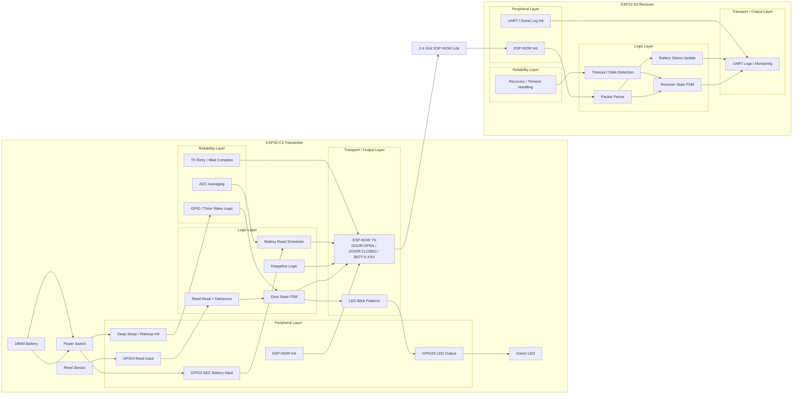
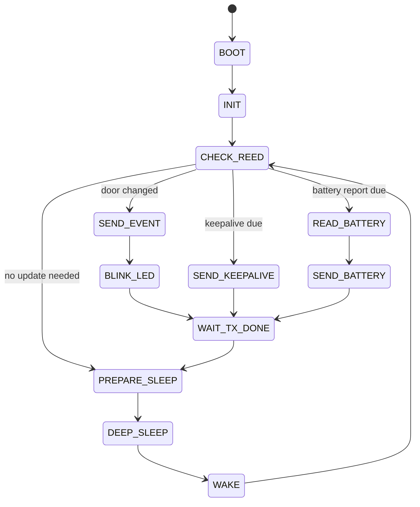
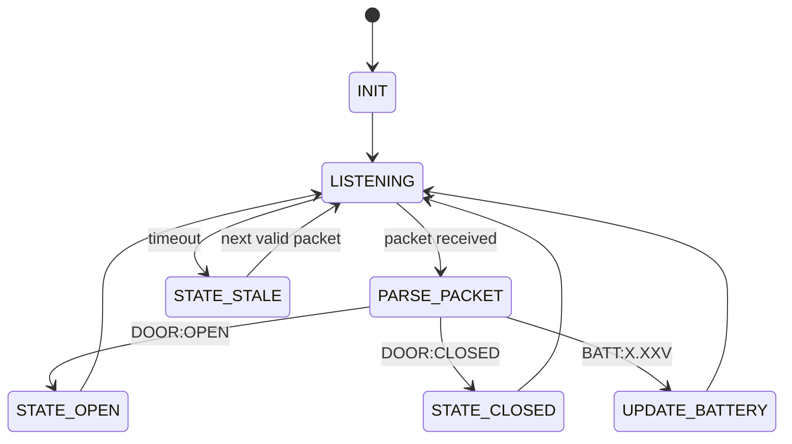

# Gate Reed Control 2.4GHz

## Overview

Dual-board ESP32 project for gate door-state telemetry over ESP-NOW.

- Xiao ESP32-C3 acts as the transmitter
- ESP32-S3 acts as the receiver
- Framework: ESP-IDF via PlatformIO
- Transport: ESP-NOW (2.4GHz)

Each firmware keeps `src/main.cpp` minimal and places runtime logic in `src/application.cpp`.

## Demo


[Video walkthrough](https://drive.google.com/file/d/1xBrTgcdc16AM0VYVUGeMaC79JifpsuX4/view)

## Hardware

| Board | Role | Key GPIO |
|---|---|---|
| ESP32-C3 (Seeed XIAO ESP32C3) | Reed sensor reader + ESP-NOW TX + deep sleep | Reed: GPIO4, LED: GPIO20 |
| ESP32-S3 (ESP32-S3-DevKitC-1) | ESP-NOW RX + state monitoring | No required sensor GPIO in current receiver build |

### Wiring Notes

- Use an external 100k pull-up resistor on ESP32-C3 GPIO4 for the reed input line for more efficient power management.
- Add an MTS-101 switch on the battery path so battery power can be disconnected while the ESP32-C3 is powered from USB.

## Communication Model

ESP32-C3 publishes gate state messages:

- `DOOR:OPEN`
- `DOOR:CLOSED`
- `BATT:X.XXV` (periodic battery voltage, e.g. `BATT:3.92V`)

ESP32-S3 listens on ESP-NOW, updates remote door state, and marks state as stale if no packet arrives for a timeout window.

## Build, Upload, Monitor

ESP32-C3:

```bash
cd ESP32-C3
pio run
pio run -t upload
pio device monitor -b 115200
```

ESP32-S3:

```bash
cd ESP32-S3
pio run
pio run -t upload
pio device monitor -b 115200
```

## Runtime Flow

ESP32-C3:

1. Initializes ESP-NOW, reed input, LED, and ADC voltage divider.
2. Reads current door state and transmits initial state (`BOOT` TX kind on first cold boot).
3. Blinks LED 3 times for OPEN, 1 time for CLOSED on state change.
4. On timer wake with unchanged state, transmits `KEEPALIVE` once the periodic keep-alive threshold is reached.
5. On timer wake, spawns a one-shot voltage task that reads the battery ADC and broadcasts `BATT:X.XXV` when the battery TX interval threshold is reached.
6. Waits in boot grace window (15 s) on cold boot to allow monitoring/flashing.
7. On wake from GPIO/timer, stays active briefly (3.5 s) to catch quick follow-up transitions.
8. Enters deep sleep; wakes on reed pin level change (GPIO wakeup) with a timer fallback wake.

ESP32-S3:

1. Initializes ESP-NOW in receiver mode.
2. Receives `DOOR:OPEN` / `DOOR:CLOSED` packets.
3. Tracks known/unknown remote door state.
4. Logs periodic heartbeat with current state.
5. Marks door state stale after timeout without packets.
6. Emits periodic push notification logs while door remains OPEN.

## System Architecture

This project follows a layered architecture across two boards:

- **ESP32-C3 transmitter** — reads the reed sensor, measures battery voltage, drives the status LED, and sends ESP-NOW packets.
- **ESP32-S3 receiver** — receives ESP-NOW packets, tracks remote state, and reports status through logs.

### GPIO Map

| Board | GPIO / Resource | Function |
|---|---|---|
| ESP32-C3 (Seeed XIAO ESP32C3) | GPIO4 | Reed sensor input |
| ESP32-C3 (Seeed XIAO ESP32C3) | GPIO2 | Battery voltage ADC input |
| ESP32-C3 (Seeed XIAO ESP32C3) | GPIO20 | Green LED output |
| ESP32-C3 (Seeed XIAO ESP32C3) | ESP-NOW / Wi-Fi | Wireless transmission |
| ESP32-C3 (Seeed XIAO ESP32C3) | Deep sleep wakeup | Wake by GPIO or timer |
| ESP32-S3 (ESP32-S3-DevKitC-1) | ESP-NOW / Wi-Fi | Wireless reception |
| ESP32-S3 (ESP32-S3-DevKitC-1) | UART | Debug and monitoring output |

### Peripheral List

ESP32-C3 transmitter:
- Reed switch sensor
- External 100k pull-up resistor on GPIO4
- RC input filter: 100Ω + 100nF
- Battery voltage divider on GPIO2: 220k / 220k
- ADC filter capacitor: 100nF
- Green LED with 470Ω resistor
- 18650 Li-ion battery
- Power switch
- ESP-NOW wireless interface

ESP32-S3 receiver:
- ESP-NOW wireless interface
- UART logging interface

### Layer Model

#### Peripheral Layer
Handles low-level hardware setup.

ESP32-C3:
- Reed GPIO initialization
- LED GPIO initialization
- ADC initialization for battery sensing
- ESP-NOW initialization
- Deep sleep and wakeup source setup

ESP32-S3:
- ESP-NOW initialization
- UART/logger initialization

#### Logic Layer
Implements the application behavior.

ESP32-C3:
- Reed state reading
- Debounce/filtering
- Door state evaluation
- Keepalive scheduling
- Battery reporting scheduling
- Wake reason handling
- Sleep decision logic

ESP32-S3:
- Packet parsing
- Door state tracking
- Battery status update
- Timeout and stale-state detection

#### Transport / Output Layer
Handles communication and visible output.

ESP32-C3:
- ESP-NOW transmission of:
  - `DOOR:OPEN`
  - `DOOR:CLOSED`
  - `BATT:X.XXV`
- LED blink indication

ESP32-S3:
- ESP-NOW packet reception
- UART log output
- State monitoring output

#### Reliability Layer
Improves robustness and fault tolerance.

ESP32-C3:
- ADC averaging
- ADC settle delay before sampling
- ESP-NOW retry handling
- Wait for TX completion before sleep
- Deep sleep power saving
- GPIO/timer wakeup recovery

ESP32-S3:
- Timeout detection
- Stale-state handling
- Recovery after missed packets

### High-Level Architecture Diagram



### Transmitter Runtime FSM



### Receiver Runtime FSM



### Queue and Mutex Notes

- A **queue** is used when one task sends commands to another task.
- In this project, the LED control path is a queue-based interaction between application logic and the LED task.
- A **mutex** is needed when multiple tasks access the same shared resource.
- If multiple tasks transmit through the same ESP-NOW path, a mutex may be used to protect the shared transmission resource.

## Project Structure

```text
ESP32-C3/
  include/
    application.h
  lib/
    esp_now/
    led/
    reed/
    voltage/
  src/
    application.cpp
    main.cpp
  CMakeLists.txt
  platformio.ini

ESP32-S3/
  include/
    application.h
  lib/
    esp_now/
  src/
    application.cpp
    main.cpp
  CMakeLists.txt
  platformio.ini

Gate_reed_control_2.4ghz.code-workspace
.gitignore
README.md
src/
```

## Notes

- ESP-NOW is connectionless and best-effort; RF environment affects reliability.
- Deep sleep on ESP32-C3 may make USB serial disappear until the next wake/reset.
- If VS Code shows stale Problems after successful builds, run a clean build and reload the window.
- KiCAd Xiao ESP32-C3 footprint from https://github.com/VectorSpaceHQ/XIAO_ESP32C3
- Seeed Xiao ESP32-C3 Wiki https://wiki.seeedstudio.com/XIAO_ESP32C3_Getting_Started

## Contact

Feedback: max.savin3@gmail.com
